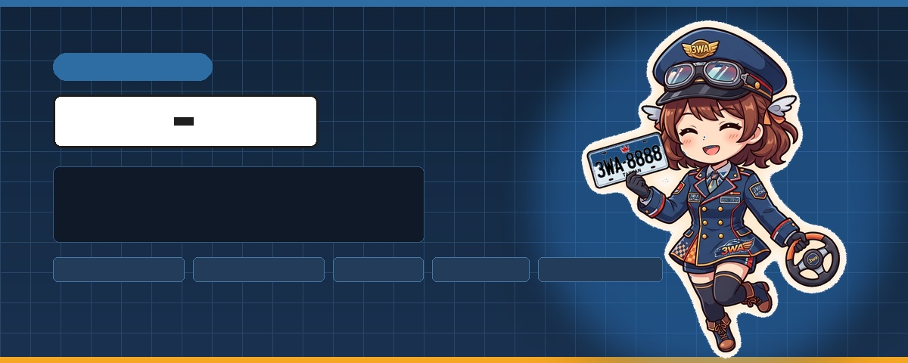

# 3waPlateAI

<p align="center">
  
</p>

3waPlateAI 是一套用於台灣車牌風格合成、訓練契約與高速辨識流程的 MIT 授權工具組。
帶有「3wa 老司機看板娘」領航的一站式視覺化 Web Studio 與一鍵 Release 部署引擎。

本公開儲存庫刻意維持為**純原始碼**：提供程式、設定、JSON Schema、文件與四張無害的合成 CI fixture，但不發布 checkpoint、訓練權重、ONNX 模型、TensorRT engine 或 Model Bundle。資料權利、法規審查、訓練算力、模型調校與後續維護均由使用者負責。

M1 提供可重現的 CPU 車牌裁切合成；M2 提供本機 PyTorch CTC 訓練與 ONNX 匯出；M3a 提供確定性的四角點校正；M3b 提供本機原生姿態偵測工作流；M4 提供本機完整 Bundle Reader 核心。效能基準、服務化與正式部署仍屬後續工作；詳細設計請見[設計規格](docs/superpowers/specs/2026-09-21-3wa-plate-ai-design.md)。

## 目前內容

| 區域 | 職責 | 狀態 |
| --- | --- | --- |
| `plateai_shared` | 訓練與推論共用的不可變規則、字元集與 JSON 契約 | 可用 |
| `plateai_trainer.synthetic` | 規則抽樣、乾淨渲染、確定性增強與交易式資料輸出 | 可用 |
| `plateai_reader` | 已驗證的本機 ONNX session、偵測後處理、校正、批次辨識與受規則限制的 CTC 解碼 | M4 Reader 核心可用，未附模型 Bundle |
| Model Bundle | 模型、字元集、規則、張量、批次、解碼與校正的雜湊驗證契約 | Schema 可用，未發布 Bundle |

## 快速開始

開發與 CI 支援 CPython 3.11。

### Windows 一鍵建置

在 PowerShell 執行：

```powershell
.\run_build.ps1
```

`run_build.ps1`（亦可雙擊或執行 `run_build.bat`）會建立被忽略的 CPython 3.11 `.venv`（優先使用 `uv`，否則使用 `py -3.11`）、安裝鎖定的訓練與測試依賴、執行完整測試、建立 `dist/`、強制安裝剛建立的 wheel、驗證 `plateai-read --help`、執行三張圖的已安裝套件合成 smoke，最後執行 `pip check`。

常用選項包括 `-BootstrapOnly`（只建立或更新環境）、`-SkipTests`、`-SkipPackage`，以及 `.venv` 不符合 CPython 3.11 時的 `-RecreateVenv`。建置只產生 Python 套件產物，不會訓練、下載或發布模型。

### PyTorch 與 GPU 顯卡版本支援

一鍵建置腳本 `run_build.bat` / `run_build.ps1` 支援 `-Cuda` 參數（預設 `auto`，自動依據本機顯卡選用適當版本）：
- **顯卡 1080 / 舊架構 (如 GTX 1080 / Pascal)**：自動或指定 `-Cuda cu118`，安裝 **`cu118`** 建置版本（`torch==2.7.1+cu118`，因較新 CUDA 版本缺少 sm_61 算力支援）。
- **顯卡 5060 或 5090 / 新架構 (如 RTX 5060、RTX 5090 / Blackwell)**：自動或指定 `-Cuda cu128`，安裝 **`cu128`** 建置版本（`torch==2.11.0+cu128`，支援 Blackwell 核心架構）。
- **純 CPU / CI 環境**：指定 `-Cuda cpu`，使用官方鎖定純 CPU 版本 (`torch==2.14.0`)。

範例：
```powershell
.\run_build.bat -Cuda cu128       # 為 RTX 5060 / 5090 一鍵安裝與建置
.\run_build.bat -Cuda cu118       # 為 GTX 1080 一鍵安裝與建置
.\run_build.bat -BootstrapOnly    # 自動偵測本機顯卡，僅初始化環境不跑測試
```

### 一鍵訓練與 ONNX 匯出 (`run_train.bat` / `run_train.ps1`)

提供開發者最直覺的一鍵訓練指令：
- **自動偵測 GPU**：預設優先使用 CUDA 訓練，無顯卡時自動退回 CPU。
- **自動補齊訓練資料**：若尚未合成訓練集，自動以專用車牌字型（`taiwan_plate`）與台灣標準規則快速合成 2,000 張訓練樣本與 500 張驗證樣本。
- **自動匯出 ONNX Bundle**：訓練完成並通過 Native/ONNX parity 驗證後，匯出至本機指定的 bundle 位置；啟用到既有辨識流程必須另行人工確認。

```powershell
.\run_train.bat                     # 一鍵自動化訓練與 ONNX 導出 (預設 10 epochs, auto-gpu)
.\run_train.bat -Epochs 20          # 指定訓練 20 輪
.\run_train.bat -Device cpu         # 強制使用 CPU 訓練
```

### 一鍵啟動 Web Studio (`run_server.bat`)

啟動 Web Studio（Port 1688），提供合成資料產生器、在線車牌標記、模型訓練監控與即時辨識測試介面：
```powershell
.\run_server.bat
```

### Web Studio 背景訓練

Web Studio 預設以不啟用 reload 的方式啟動；開發時才明確加上旗標：

```powershell
.\run_server.bat
.\run_server.bat --dev-reload
```

從訓練頁開始的工作會由獨立背景 worker 執行，所以關閉 Web Studio 或開發 reload 不會自動停止它；請回到訓練頁按「中斷訓練」，等待畫面確認已停止。每次 Web 訓練會建立新的 `runs\<run-name>` 與 `models\bundles\train-<task-id>`，完成只代表「已匯出，尚未啟用」。請先檢視 bundle 與驗證結果，再依你的部署流程人工選擇是否啟用模型。

### 一鍵下載真實測試照片 (`run_get_test_data.bat` / `run_get_test_data.ps1`)

自動從公開真實台灣車牌資料集（EZCon）下載實際道路車輛與車牌照片至 `test_data/`，供本機測試檢驗：
- 影像自動命名為 `{序號}_{真實車牌號碼}.jpg`（例如 `002_MYX-6873.jpg`），一眼即可辨識 Ground Truth。
- 自動生成 `labels.json` 記錄真實標註與旋轉框座標。
- 極速多線程下載，30 張照片僅需 1 秒內完成。

```powershell
.\run_get_test_data.bat               # 下載預設 30 張台灣真實車牌測試照片至 test_data\
.\run_get_test_data.bat -Count 50     # 下載 50 張
.\run_get_test_data.bat -Count all    # 下載全數 259 張真實測試照片
```

## M1 合成車牌資料

- 預設輸出 RGB `uint8` 的 380×160 PNG，對應新式自用小客車比例，並記錄來源或變換後的四角點。
- OCR canonical label 不含裝飾用連字號；顯示字串保留連字號。
- 每一樣本由 run seed 與 index 推導獨立 seed；在鎖定的 Python 3.11 依賴下，字串、增強參數、metadata 與影像皆可重現。
- 預設新式自用小客車為白底黑字、`LLL-DDDD`，並排除 `I`、`O`、`4`。
- 預設字型是以 OFL-1.1 授權隨附的 Noto Sans Mono 視覺近似字型。若要用本專案的台灣車牌專用字型生成訓練資料，請明確指定 `--font taiwan_plate`：

  ```powershell
  .\.venv\Scripts\plateai-generate generate `
    --count 10000 `
    --seed 42 `
    --font taiwan_plate `
    --output out\train-taiwan-plate-font
  ```

  每次生成會記錄字型檔名與 SHA-256。`TaiwanPlate-Regular.ttf` 是以專案內的公路局參考資料建立，供本機合成與視覺比較使用；它不表示主管機關以產品形式發布此字型，或已授予衍生材料的一般再散布權。

- 機車色牌採 `plate_type` 選擇模板，不從任意車牌字串猜測車種。可產生一般重機白底黑字、250–550cc 黃底黑字、550cc 以上紅底白字，以及 50cc 綠底白字：

  ```powershell
  .\.venv\Scripts\plateai-generate generate `
    --charset configs\charsets\tw_new_style_private_passenger_v1.txt `
    --rules configs\plate_rules\tw_motorcycle_colours_v1.json `
    --template configs\plate_templates\tw_motorcycle_colours_v1.json `
    --output out\motorcycle-colours
  ```

  此組輸出尺寸與類型可變，供視覺與後續多 profile 工作使用；不可直接餵給目前固定 380×160 小客車契約的 M2/M4 recognizer。

- **全台統一 OCR 字串規則（Unified Standard Profile）**：
  涵蓋全台車牌文字格式（新式七碼 `LLL-DDDD`、舊式六碼 `LL-DDDD` / `DDDD-LL`、機車六碼 `LLL-DDD`、機車混合碼 `LLD-DDD` / `DLL-DDD`，以及舊式五碼/四碼 `LL-DDD` / `DDD-LL` / `LL-DD` / `DD-LL`），並補齊包含數字 `4` 的 34 字元集（10 數字 + 24 字母，排除 `I`、`O`）。
  > **注意**：`tw_standard_v1.json` 是「統一 OCR 字串規則」（plate_type 均為 standard，供模型學習全台合法號牌文字結構），不是用於辨識車牌底色或車種的視覺模板；若需要特定底色（如黃牌、紅牌、綠牌）之視覺渲染，請搭配色牌模板。

  合成資料生成：
  ```powershell
  .\.venv\Scripts\plateai-generate generate `
    --charset configs\charsets\tw_standard_v1.txt `
    --rules configs\plate_rules\tw_standard_v1.json `
    --font taiwan_plate `
    --count 10000 `
    --seed 42 `
    --output out\train-std
  ```

  訓練 35 類（34 字元 + Blank）辨識模型與導出 ONNX Bundle：
  ```powershell
  .\.venv\Scripts\plateai-train --train out\train-std --validation out\val-std --output runs\std-cpu --charset configs\charsets\tw_standard_v1.txt --rules configs\plate_rules\tw_standard_v1.json --epochs 10
  .\.venv\Scripts\plateai-export --checkpoint runs\std-cpu\best.pt --report runs\std-cpu\report.json --output models\bundles\tw-std-v1 --charset configs\charsets\tw_standard_v1.txt --rules configs\plate_rules\tw_standard_v1.json
  ```

`tests/fixtures/synthetic/` 下的四張 PNG 是演算法建立的玩具輸入，只用於驗證程式與契約，不含真實車輛或可識別的車牌資料，也不構成辨識準確度聲明。

## M2 本機辨識訓練

選用的 `training` extra 提供符合裁切契約的本機 PyTorch CTC trainer 與 ONNX exporter。它使用 Pillow golden 灰階前處理、80 個 CTC timestep、blank index 0，支援動態類別數（預設 34 類，統一規格為 35 類），並在發布被忽略的本機 Bundle 前檢查 PyTorch 與 ONNX parity。

- **自動硬體偵測（預設 `--device auto`）**：執行訓練時自動偵測 GPU，預設優先使用 CUDA 進行 GPU 加速訓練；若系統未偵測到可用顯卡或 CUDA 不可用，則自動平順退回 CPU 訓練。使用者亦可明確指定 `--device cuda` 或 `--device cpu`。
- 資料集、權重、ONNX、run 與 Bundle 均不提交；詳見[訓練與資料集指南](docs/training.md)。

## M3a 四角點校正

`plateai_reader.rectifier` 接受 `uint8` RGB 來源影像及任意排列的四個有限、在畫面內的角點。它先檢查凸包、拒絕退化或方向不明的幾何，再以車牌長邊判定上下與左右語意，輸出給 M2 使用的固定 RGB `160×380` 裁切圖。

Warp 目標是離散像素 `(0,0)`、`(379,0)`、`(379,159)`、`(0,159)`，使用 OpenCV 雙線性插值與白色常數邊界。identity regression 會檢查所有外框輸出像素都對應到來源座標，避免最後一列或最後一欄混入邊界色。M3a 不含偵測資料、偵測訓練、偵測權重或偵測 ONNX；那些是 M3b 的範圍。

## M3b 本機姿態偵測

M3b 是給使用者自行提供、且具合法使用權背景圖 manifest 的本機工作流。原生偵測器輸入為 640×640 OpenCV RGB letterbox，輸出 pre-NMS `[batch,8400,13]` candidates。確定性 NMS 後，每個保留的四角點會獨立交給 M3a 做固定 RGB `380×160` 校正；單一壞姿態不會阻止其他候選進入 recognizer 邊界。

資料合成、偵測器訓練與完整 Bundle 匯出，請依[偵測器工作流](docs/training.md#local-m3b-detector-workflow)執行。原始碼驗收刻意不包含背景圖、偵測權重、ONNX、TensorRT benchmark、瀏覽器整合或正式環境辨識指標。

## M4 本機 Reader

`plateai-read` 只會在驗證 manifest、宣告檔案雜湊與 ONNX 契約後載入使用者自行訓練的本機完整 Bundle。它保留 detector 與 recognizer 的 ONNX Runtime session，預設依序偏好 TensorRT、CUDA、CPU，執行確定性 NMS 與校正，依 recognizer manifest 分批處理標準化裁切圖，並用受規則限制的 CTC 解碼。例如：

```powershell
.\.venv\Scripts\plateai-read --bundle models\bundles\v1-full-local --image C:\local\frame.png --warmup 5
```

命令輸出 JSON，包含保留的偵測結果、個別拒絕原因、canonical/display 文字、偵測信心值與各階段觀察時間。時間僅是本機量測，不是 GPU 效能或實地準確度聲明。儲存庫仍不含完整 Bundle、ONNX、真實影像或 benchmark 結果。

## 用自己的資料訓練

使用公開生成器，僅匯入具有合法權利的資料集，並針對自己的領域訓練 Bundle。真實車牌照片、正式資料、沒有再散布權的字型及訓練產物不應放入此儲存庫。可用的外部評估來源與權利邊界請見[評估來源說明](docs/evaluation-sources.md)；本機模型政策見[models/README.md](models/README.md)。

## 授權

專案原始碼採 [MIT License](LICENSE)。MIT 不會重新授權相依套件、外部字型、資料集或模型；請見[第三方告知](THIRD_PARTY_NOTICES.md)。
